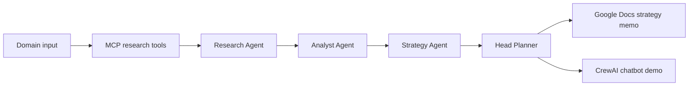

# GTM Multi-Agent Research and Planning System

This project implements a multi-agent go-to-market research and planning workflow in both n8n and CrewAI. It delivers the requested architecture:

- Head Planner (orchestrator and documenter)
- Research Agent (market and competitor finder)
- Analyst Agent (insight synthesis)
- Strategy Agent (GTM plan builder)

The solution is designed to support desk research, competitor benchmarking, and structured strategy drafting before exporting a final strategy document for Google Docs or a similar workspace.

## Architecture



The system splits the work into four roles:

1. Head Planner
   - coordinates the flow
   - assembles intermediate outputs
   - owns the final strategy document
   - tracks the reasoning chain and execution state

2. Research Agent
   - collects desk research signals
   - finds competitors and market trends
   - interprets buyer behavior and sales motions

3. Analyst Agent
   - synthesizes signals into strategic themes
   - identifies overlaps and gaps
   - creates the opportunity narrative

4. Strategy Agent
   - converts research and analysis into a GTM plan
   - defines messaging, segments, channels, and launch milestones
   - prepares a founder- or exec-ready narrative

## Submission Artifacts

| Requirement | Included artifact |
| --- | --- |
| n8n workflow export | `n8n/gtm_workflow_export.json` |
| CrewAI UV project | `crewai_project/pyproject.toml` and `crewai_project/src/gtm_project/` |
| Sample Google Doc output | `docs/sample_google_doc_output.md` |
| CrewAI chatbot screenshot | `docs/chatbot_screenshots/gtm-chatbot-demo.png` |
| Architecture, setup, and testing notes | This README |

## n8n Workflow

The exported workflow file in this project is a structured n8n workflow JSON template that represents the orchestration flow:

- Start node
- MCP or web research tool call
- Research Agent node
- Analyst Agent node
- Strategy Agent node
- Head Planner summary node
- Google Docs export node

The Code nodes are JavaScript-based and can be tested one node at a time through n8n's Execute Node control. The Google Docs node expects credentials configured inside n8n plus the `GOOGLE_DOC_ID` environment variable.

## CrewAI Implementation

The CrewAI project under `crewai_project/` gives a UV-native Python setup for developing the same workflow in Python. The project includes:

- project metadata in `pyproject.toml`
- agent definitions in `src/gtm_project/agents.py`
- task bundling in `src/gtm_project/tasks.py`
- the executable workflow in `src/gtm_project/main.py`

The workflow accepts a domain such as fintech, healthtech, or SaaS and produces a GTM strategy document with the following sections:

- market summary
- competitive scan
- customer segments
- positioning
- channel strategy
- launch timeline
- KPIs
- risk and dependencies

## Setup

### Ubuntu VM Prerequisites

- Node.js and npm
- n8n
- Python 3.11+
- UV
- Optional: SerpAPI key and MCP server access

### n8n Setup

1. Install Node.js and n8n.
2. Start n8n.
3. Import the workflow JSON from `n8n/gtm_workflow_export.json`.
4. Configure MCP and web-search integrations.
5. Test the nodes using the Execute Node and HTTP requests.

### CrewAI Setup

```bash
cd gtm_multi_agent/crewai_project
uv sync
uv run python src/gtm_project/main.py --domain fintech
```

### Offline Chatbot Screenshot

The chatbot is designed for repeatable demo evidence without a paid model provider:

```bash
cd gtm_multi_agent/crewai_project
uv sync
uv run streamlit run src/gtm_project/chatbot.py
```

Enter a prompt such as `Build a GTM plan for compliance automation in fintech`, then capture the completed response. The included screenshot was produced from this flow.

## Testing Notes

Run the following checks before submission:

```bash
# Start the MCP stdio server and list its tools through the client.
python verify_mcp_client.py

# Verify the CrewAI module sources compile.
python -m compileall -q crewai_project/src

# Validate the n8n export JSON.
python -m json.tool n8n/gtm_workflow_export.json > /dev/null
```

For n8n, import the workflow, configure valid MCP and Google credentials, then execute `Domain Input`, `MCP Research Tool`, each agent Code node, and `Google Docs Export` independently. Record any credential or endpoint failures in the n8n execution view; do not add API keys or document IDs to this repository.

## Sample Google Docs Output

A sample exported output is included in:

- `docs/sample_google_doc_output.md`

This file represents the kind of final strategic document that could be pasted into a Google Doc or exported through the Docs API.

## Design Trade-offs

This project is intentionally designed as a practical demonstration rather than a full live research engine. The main trade-offs are:

- deterministic template-based reasoning rather than fully autonomous web crawling
- offline-ready output generation for demo use
- simplified MCP and tool wiring that can be upgraded to live sources
- narrative-first strategy generation to keep the workflow readable and explainable

The project separates credential-free demonstration artifacts from live integrations. The chatbot and sample memo are deterministic so they can be reviewed offline; CrewAI/MCP and n8n integrations remain available for a configured environment with real model, Google Docs, and search credentials.
